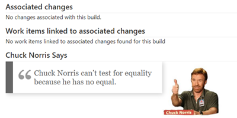

# Add Chuck Norris quotes to your VSTS build report #
This VSTS build extension will show a new section in your build reports with an encouraging Chuck Norris quote.

See [Overview](./docs/overview.md) for details on how the extension works and is intended to be used.

# Building the extension #

The extension is built and deployed to the VSTS Marketpace using VSTS, if you want to contibute to the public extension see [Contributions are welcome](#contributions-are-welcome).

## Pre-requisites ##
The extension has the following pre-requisites:

1. [Node.js](https://nodejs.org)

## Building the extension ##
The extension uses a `package.json` to define the build process. You should modify `vss-extension.json` and replace the publisher with the one you intend to use.

1. Download dependencies `npm install`.
2. Build the extension `npm run build`. 

See [https://www.visualstudio.com/en-us/docs/integrate/extensions/get-started/node](https://www.visualstudio.com/en-us/docs/integrate/extensions/get-started/node) for details on how to create and publish an extension.

# Contributions #

## Team ##

We thank the following contributor(s): **Mathias Olausson**.

## Credits ##

[The Ultimate Top 25 Chuck Norris “The Programmer” Jokes](http://codesqueeze.com/the-ultimate-top-25-chuck-norris-the-programmer-jokes/)

## Contributions are welcome ##

Here is how you can contribute to this project:  

- Submit bugs and help us verify fixes  
- Submit pull requests for bug fixes and features and discuss existing proposals   

Please refer to [Contribution guidelines](.github/CONTRIBUTING.md) and the [Code of Conduct](.github/COC.md) for more details.